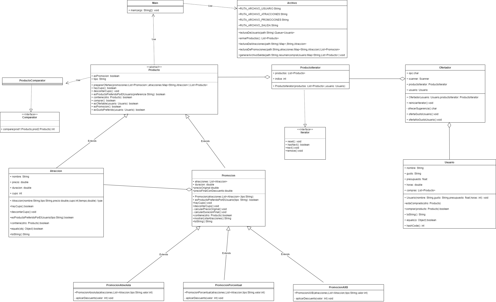

# Hogwarts
 
## Participantes del grupo
- Castillo, Alexis
- Fernandez, Sebastián
- González, Victor
- Masi, Isaias
- Pergola, Juan Manuel
- Salvatierra, Florencia

## Video
[Link de video de la demostración](https://drive.google.com/drive/folders/1nZLOFjVlc7VoYF13zhP4IL-uucW3ix3t?usp=drive_link)

## Repositorio
[Link del repositorio del proyecto](https://github.com/SebFernandez/Hogwarts)

## Diagrama de clases
El archivo se llama DiagramaDeClasesHogwarts, tiene el formato de drawio. Está listo para ser abierto en la plataforma misma.

## Como ejecutar la aplicación
Para probar el programa, se debe contar con un IDE instalado previamente en la computadora. En este caso, vamos a utilizar Eclipse. Para ello, debemos importar el proyecto "Hogwarts" a nuestro Eclipse, y presionar el botón de "Ejecutar".
Para importarlo, podemos descargarnos el zip del Repositorio y extraerlo en la carpeta de nuestro workspace. Acto seguido, vamos a File/import. Seleccionamos la opción de "Existing Projects into Workspace", y seleccionamos la carpeta que recién extraímos de Hogwarts.
De esta manera, el proyecto ya debería aparecernos en la parte izquierda y estaría listo para ser ejecutado. El usuario, únicamente debería abrir la clase Main, y presionar el botón verde de "Ejecutar".
